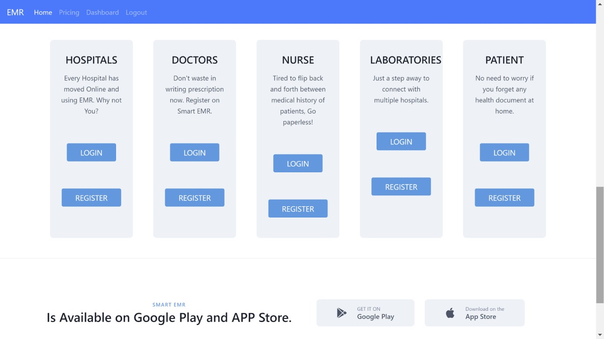

# Smart Electronic Medical Record

This application is developed to help hospitals, patients, pharmaceutical companies, and health R&D companies with more efficient and effective ways of communication by hospitals for better health outcomes and targeted communication to prime patient groups for a new treatment/drug leveraging the power of data analytics. 

The solution manages the database of patient records and discharge summaries to identify patients who are good candidates for newly launched medicines, treatments etc.

## Installation

From the root of the repository run 
```bash
pip install -r requirements.txt
```

```bash
python manage.py runserver
```

Access the UI from the browser

## Built With

1. Bootstrap
2. Django
3. SQLite
4. Pandas
5. Scikit Learn

## Homepage
<p align="center">
  
</p>

## Portals

Separate portals for Hospitals, Doctors, Nurses, Patients, Labs to view database

<p align="center">
  
</p>

## Hospital Dashboard

<p align="center">
  
</p>

<p align="center">
  
</p>

## Doctors Dashboard

<p align="center">
  
</p>


<p align="center">
  
</p>

<p align="center">
  
</p>

## Patient Homepage

<p align="center">
  
</p>

<p align="center">
  
</p>

<p align="center">
  
</p>

<p align="center">
  
</p>

<p align="center">
  
</p>

## Laboratories

<p align="center">
  
</p>
